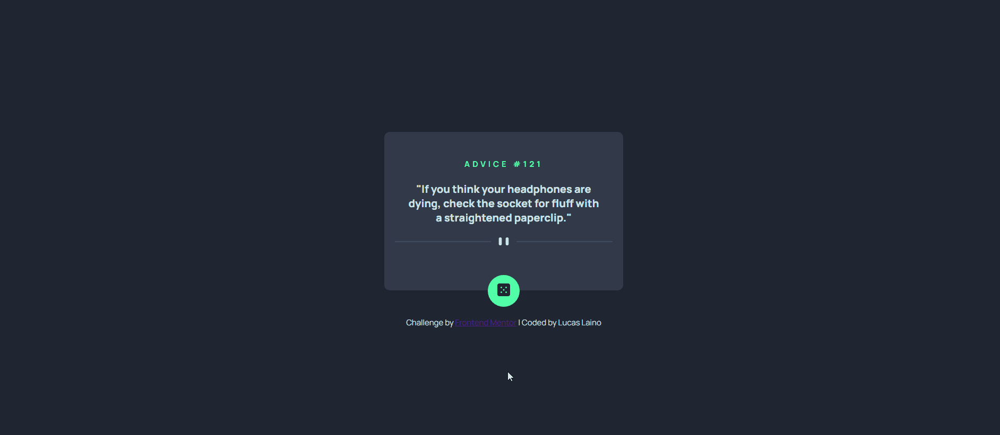

# Frontend Mentor - Advice generator app 

Essa é a solução do [Advice generator app challenge on Frontend Mentor](https://www.frontendmentor.io/challenges/advice-generator-app-QdUG-13db). .

## Tabela de Conteúdos

- [Visão Geral](#visao-geral)
  - [O Desafio](#o-desafio)
  - [Screenshot](#screenshot)
  - [Links](#links)
- [Meu Processo](#meu-processo)
  - [Construído com](#construido-com)
  - [O Que Eu Aprendi](#o-que-eu-aprendi)
  - [Desenvolvimento Futuro](#desenvolvimento-futuro)
  - [Recursos Úteis](#recursos-uteis)
- [Autor](#autor)

## Visão Geral

### O Desafio

O desafio consiste em um gerador de conselhos com consumo de API. Ao clicar no botão, é disparado um evento de click que roda a função que busca a requisição da API, o conselho é exibido na tela junto com o seu número de identificação.

### Screenshot



### Links

- Live Site URL: [Advice generator app](https://lucaslaino.github.io/frontend-mentor-advice-generator-app/)

## Meu processo

### Construído com

- Tags semânticas de HTML
- CSS 
- JavaScript
- Fetch API
- [Google Fonts](https://fonts.google.com/) - Para fontes 

### O Que Eu Aprendi

Com esse projeto eu aprendi na prática sobre o consumo de API e pude melhorar minha prática com o JavaScript. 

Abaixo está destacado o código JavaScript do projeto que eu gostaria de destacar.

```js
const adviceNumber = document.querySelector(".advice-id")
const adviceText = document.querySelector(".advice-text")
const btnAdviceGenerator = document.querySelector("#btn-advice-update")

async function getAdvice() {
    try {
        const response = await fetch("https://api.adviceslip.com/advice")
    
        if (!response.ok) {
            throw new Error("Ocorreu um erro ao tentar buscar as informações da API");
        }

        const adviceContent = await response.json();
        const adviceId = `Advice #${adviceContent.slip.id}`;
        const adviceDescription = `"${adviceContent.slip.advice}"`;
        
        adviceNumber.innerHTML = adviceId
        adviceText.innerHTML = adviceDescription
    
    }catch (error) {
        console.error("Erro ao tentar buscar as informações da API", error)
    }
}

    btnAdviceGenerator.addEventListener("click", getAdvice);

    getAdvice();
```

### Desenvolvimento Futuro

 Pretendo ver mais a fundo sobre o consumo de API, aprender mais sobre o fetch e praticar mais o JavaScript.

### Recursos Úteis

- [API de conselhos](https://api.adviceslip.com/#endpoint-random) - Esse é o site da API de gerador de conselhos, tem alguns detalhes que foram úteis no desenvolvimento do projeto.

- [Documentação de funções assíncronas](https://developer.mozilla.org/pt-BR/docs/Web/JavaScript/Reference/Statements/async_function) - Essa documentação de funções assíncronas foi essencial para a construção do projeto.

## Autor

- LinkedIn - [Lucas Laino](https://www.linkedin.com/in/lucaslaino/)
- Frontend Mentor - [@LucasLaino](https://www.frontendmentor.io/profile/LucasLaino)